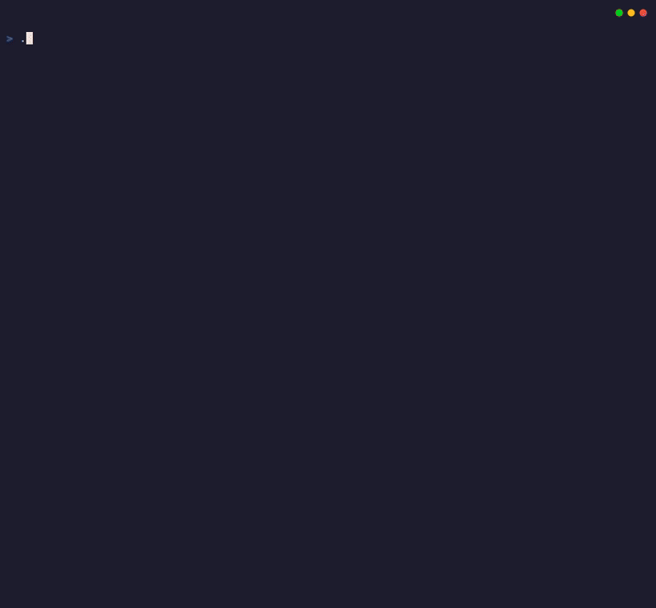

# Jive Visualiser ✨

> Spin your podcast .wav into a groovy MP4 visualiser with spring-driven real-time audio frequencies.

_Formerly known as Jivefire._

## The Groove

Your podcast audio deserves more than a static image on YouTube. Jive Visualiser transforms WAV/MP3/FLAC into delightful 720p visuals—bars that breathe with your dialogue, rise with your laughter, and groove through every frequency.

<div align="center"></div>

### What's Cooking

- 🖼️ **Thumbnail generator** YouTube-style PNG with your title, saved alongside the video
- 🎬 **1280×720 @ 30fps** H.264/AAC YouTube-ready MP4, no questions asked
  - 🎚️ **64 frequency bars** that look discrete (not that smeared spectrum nonsense)
  - 🪞 **Symmetric mirroring** above and below centre, doubles the visual impact
  - 🔬 **FFT-based analysis** 2048-point Hanning window, linear frequency binning, log-scaled amplitude
  - ✨ **Spring-driven bar dynamics** bars snap up instantly, spring back down via harmonica peak-hold
- 🚀 **Stupidly fast** streaming pipeline, parallel RGB→YUV conversion
  - ⚡ **GPU acceleration** auto-detected: NVENC, Vulkan, VA-API, QuickSync, VideoToolbox
- 📦 **Single binary** No Python. No FFmpeg install required. Just drop and render
  - 🐧 **Linux** (amd64 and AArch64)
  - 🍏 **macOS** (x86 and Apple Silicon)

## Usage

### Generate Video
```bash
./jive-visualiser input.wav output.mp4
```

### With Episode Number and Title
```bash
./jive-visualiser --episode=42 --title="Linux Matters" input.wav output.mp4
```

### Without Episode Number (Unnumbered Audio)
```bash
./jive-visualiser --title="Linux Matters" input.wav output.mp4
```

`--episode` is optional. Omitting it suppresses the episode number overlay entirely — useful for archive or bonus audio that has no episode number. Passing `--episode=0` still renders `00` on-screen (single-digit values are zero-padded, so `5` renders as `05`); absence is what controls the overlay, not the value.

### Example

<div align="center">
  <a href="https://video.linuxmatters.net/w/4whYe7wNzcSr3dWL98zMTp" target="_blank">
    
  </a>
</div>

## Build

Jive Visualiser uses [FFmpeg statigo](https://github.com/linuxmatters/ffmpeg-statigo) for FFmpeg static bindings.

```bash
# Setup or update ffmpeg-statigo submodule and library
just setup

# Build and test
just build        # Build managed binaries, then the versioned root binary
just test         # Run full vet and tests with console coverage
just lint         # Check modules, formatting, source, vulnerabilities and workflows
just lint correct # Explicitly tidy modules and format source
just test-encoder # Run the separate audio/video checks
```

Go tooling uses Tailor with CGO enabled. `just setup` is explicit. It can update Git configuration, submodules, archives and the index, and use the network. Quality commands never run setup.

The existing `.golangci.yml` remains the project policy. `just/project/build.sh` retains version injection and the root binary. Benchmarks, `test-encoder`, and `vhs` remain separate commands. `just release x.y.z` retains unprefixed release tags.

Review the generated `nix/` files before staging them. Git-backed flakes exclude untracked files. The shell watches Nix package and hook files, but reload remains manual.

On NixOS, graphics hooks retain application libraries before host libraries without duplicate paths. They preserve explicit `ONEVPL_SEARCH_PATH`, `LIBVA_DRIVERS_PATH` and `VK_DRIVER_FILES` values, including empty values. Set `TAILOR_NIXOS_DRIVERS=0` to disable driver hooks. GPU detection no longer runs in the shell. Set `LIBVA_DRIVER_NAME` explicitly when driver selection is necessary. For Intel, use `iHD` and include the Intel package's `lib/dri` directory in `LIBVA_DRIVERS_PATH` when host drivers do not provide it.

## Why Jive Visualiser?

FFmpeg's audio visualisation filters (`showfreqs`, `showspectrum`) render continuous frequency spectra, not discrete bars. No amount of FFmpeg filter chain kung-fu can achieve the discrete 64-bar aesthetic required for Linux Matters branding. Solution: Do the FFT analysis and bar rendering in Go, pipe frames to FFmpeg for encoding.

**Why Go over Python?** The original `djfun/audio-visualizer-python` tool is a moribund Qt5 GUI with significant tech debt. For our podcast production needs we wanted multi-architecture tools that can integrate into automation pipelines.

The Jive Visualiser architecture, such as it is, is available in the [architecture document](docs/ARCHITECTURE.md).
